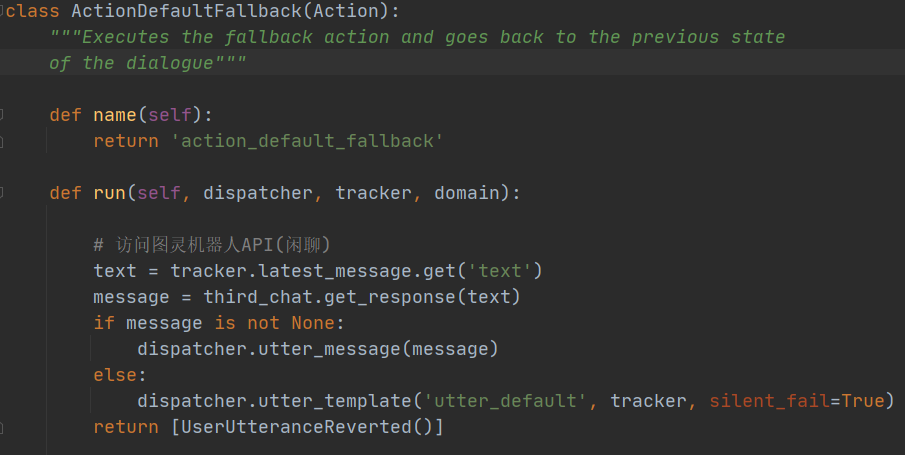

## custom action

+ **rasa run actions**

需要使用自定义的action，首先运行上述命令启动server

+ **编写自定义Action**

Action Class为任何自定义操作的基类。要定义自定义动作，请创建Action该类的子类并覆盖两个必需的方法name和run。当动作服务器name收到运行动作的请求时，它将根据其方法的返回值调用动作。

dispatcher –用于将消息发送回用户的调度程序。utter_message方法可用于将任何类型的响应返回给用户，tracker –当前用户的状态跟踪器。可以通过Tracker属性和方法获取有关过去事件和会话当前状态的信息，如：访问插槽值 tracker.get_slot(slot_name)，最新的用户消息是tracker.latest_message.text