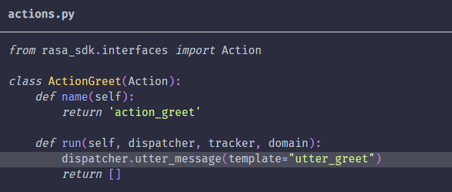

****

## NLU.yml

+ intent与entity在data/nlu.yml中定义,同义词（Synonym）也在data/nlu.yml中定义

+ **正则表达式（Regular Expression）**：(算法会优先使用正则表达式匹配实体，正则表达式太多会影响模型性能，只有在模式清晰简单的时候再用正则表达式)

+ Lookup Table(查表)

+ domain.yml指定了机器人应该知道的意图(intent)、实体(entity)、槽(slot)、响应(response)、表单(form)和动作(action)。它还定义了会话会话的配置

+ 1.**intents**

      2.  **entities**

 3.**slot**(slot是对话机器人的记忆，可以存储用户提供的信息，influence_conversation指定slot是否会影响对话)

4.**Responses**

**Calling Responses from Custom Actions**

5.**Actions**

  5.1   **Responses**

  5.2   **Default Actions**

  5.3   **Forms**

为了使用form action，需要在config.yml文件中添加如下内容：

**form在domain.yml中定义**：

Once the form action gets called for the first time, the form gets activated and will prompt the user for the next required slot value. It does this by looking for a response called utter_ask_<form_name>_<slot_name> or utter_ask_<slot_name> if the former isn't found. Make sure to define these responses in your domain file for each required slot.

**Activating a Form**

5.4**Custom Actions**

## 常用命令

+ **rasa data split nlu**

将data/nlu划分为训练集与测试集，会新建一个train_test_split文件夹，划分好的train/test文件(.yml)位于这里。

+ **rasa train nlu/rasa test nlu**

+ **rasa shell nlu**
+ **rasa init**

+ **rasa data validate stories** （验证story是否正确）

