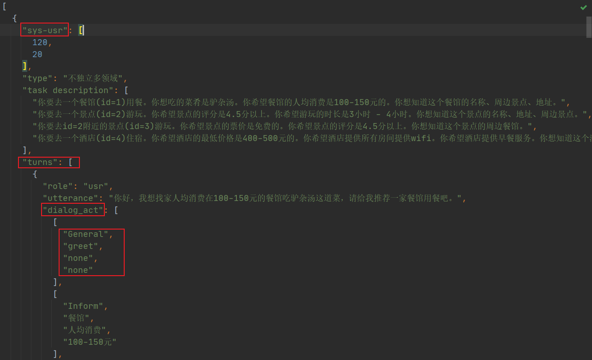
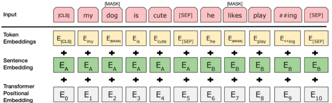
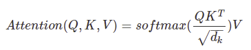
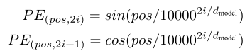
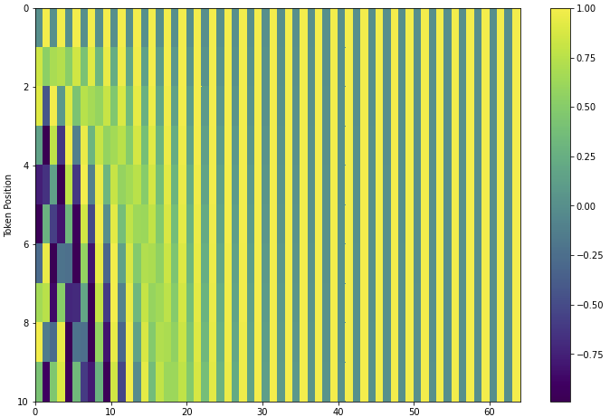

# 第四周学习笔记

## CrossWOZ数据集

> CrossWOZ是一个大规模**跨领域中文**任务导向多轮对话数据集。2018年清华大学计算机系、人工智能研究院 CoAI 小组构建了 CrossWOZ，被评为当年 EMNLP 最佳资源论文，由于其大规模多领域的特点，引发了任务导向对话领域新的一轮发展热潮。

+ 数据集包含 6K 个对话，102K 个句子，涉及 5 个领域**（景点、酒店、餐馆、地铁、出租）**。平均每个对话涉及 3.2 个领域，远超之前的多领域对话数据集，增添了对话管理的难度。

+ dialog_act为四元组，分别表示intent，domain，entity，slot

## BERT

### input

### task

+ **Masked LM**，在该任务下，输入的句子会有15%的token被修改，修改的方式如下：在80%的情况下该单词会变成[mask] token，在10%的情况下该单词会被修改为另外一个单词；在10%的情况下该单词不会改变。BERT需要对该被修改的单词进行预测，预测其原来的单词是什么。
+ **NSP**，对句子是否是上下连续的两句进行预测，[sep] token两侧的句子有50%的概率是前后句，有50%的概率不是前后句。

###  contribution

+ 证明了双向预训练对语言表示的重要性。与之前使用的单向语言模型进行预训练不同，BERT使用遮蔽语言模型来实现预训练的深度双向表示。
+ 预先训练的表示免去了许多工程任务需要针对特定任务修改体系架构的需求。BERT是第一个基于微调的表示模型，它在大量的句子级和token级任务上实现了最先进的性能，强于许多面向特定任务体系架构的系统。
+ BERT刷新了11项NLP任务的性能记录。

## transformer

+ self attention

+ position encoding

