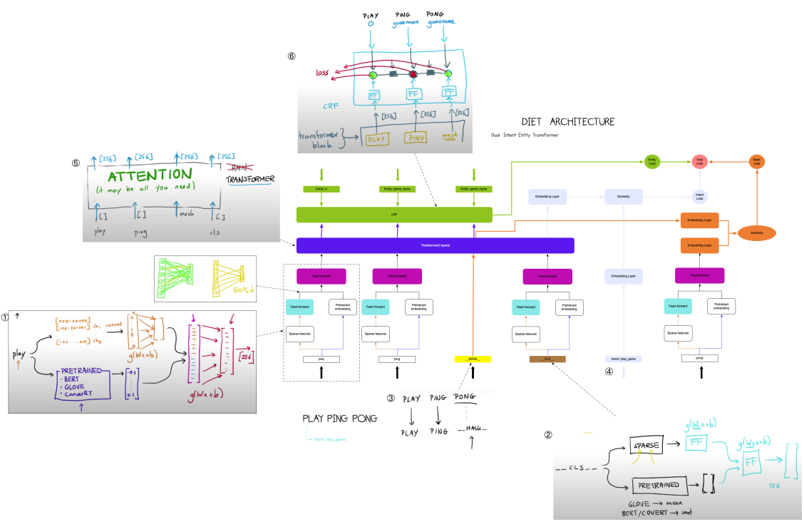

# Rasa NLU (DIET)

## How it works

### Token block

+ sparse feature 
+ dense feature  

在全连接层之前使用dropout，随机去掉80%，因为将sparse feature与dense feature拼接之后维度较高，dropout可以较少参数，缓解过拟合。

### Transformer

+ \_\_mask\_\_与\_\_cls\_\_ 
+ embedding layer
+ \_\_cls\_\_ 经过transformr编码之后再经过embedding layer编码，然后与经过embedding编码的intent做相似度计算

+ \_\_mask\_\_ 在经过transformer之后再经过embedding layer编码，然后与经过Token block和embedding layer编码的intent做相似度计算

### star space算法(embedding everything)

+ 共现矩阵

### entity识别(序列标注)

+ CRF

### Loss

+ entity loss
+ intent loss
+ mask loss  

## Why does this architecture look this way ?

+ 灵感来源于乐高积木
+ 使用mask的原因是对话机器人中的文本更随意，变化更多，使用mask能增加任务难度，提高模型泛化性能

## How to choose pipeline

+ easy: no entity，no mask，lager embedding
+ hard: mask，bert，bigger feedforward，more transformer layers
+ RPI(小模型): no dense feature，embedding使用90%，更小的embedding

# Introduction to DST  

+ hidden slot，普通slot的优先级高于hidden slot
+ 如果缺失某个必须存在的slot，执行clarify intent动作(multi-turn)
+ history in memory。两个维度：how much and how long
+ slot with slot：平级槽，依赖槽
+ change slot、repeat intent、system state

# FSM(有限状态机)

+ 有限个状态以及在这些状态之间的转移和动作等行为的数学模型

**有限状态机一般都有以下特点：**

1. 可以用状态来描述事物，并且任一时刻，事物总是处于一种状态；
2. 事物拥有的状态总数是有限的；
3. 通过触发事物的某些行为，可以导致事物从一种状态过渡到另一种状态；
4. 事物状态变化是有规则的，A状态可以变换到B，B可以变换到C，A却不一定能变换到C；
5. 同一种行为，可以将事物从多种状态变成同种状态，但是不能从同种状态变成多种状态。

