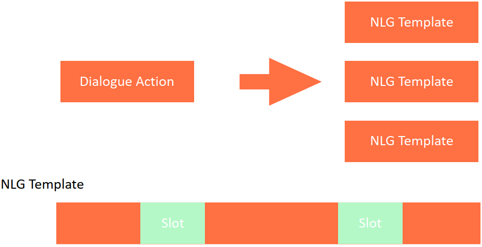
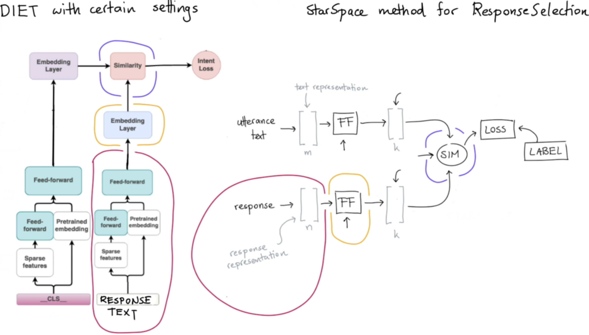
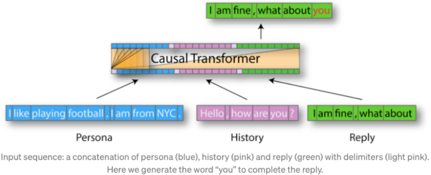
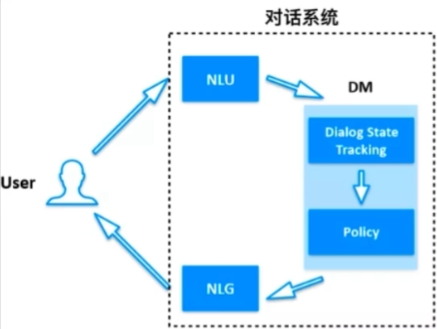
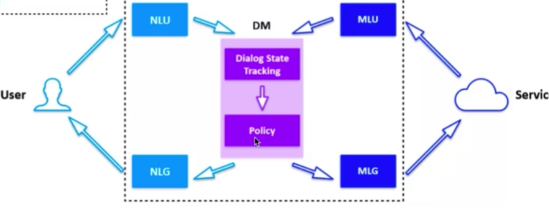
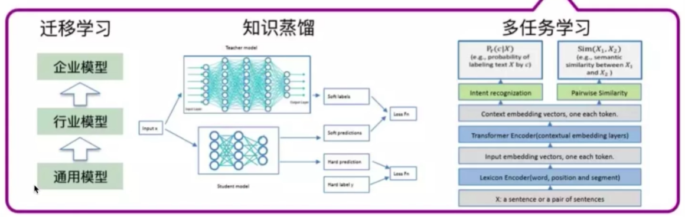
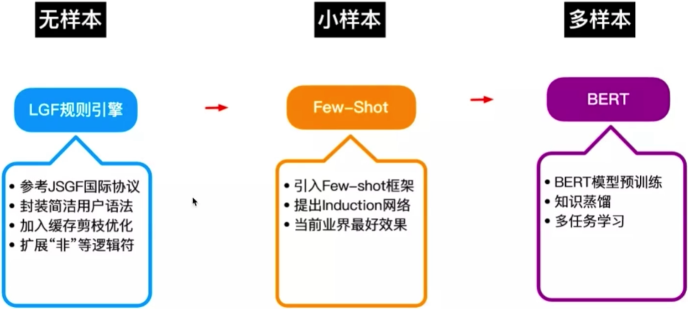

### Model-based Dialogue Policy  

+ 缺点：计算量过大、缺少训练数据、可控性差
+ model based DP需要想办法自动产生数据，常用的做法是增强学习**（马尔科夫链、强化学习）**
+ metrics：评判一个action好坏的指标：对话轮次、对话时间、对话情感变化；
+ 不同任务对对话轮次要求不同，在任务型对话中希望轮次越少越好，在闲聊任务中可能希望对话轮次越多越好。

### Template-based Natural Language Generation  

+ 工业场景中最常用的方法，优点是容易控制。

### Rasa Response Selector  

+ 类似于starspace的思想，将用户对话文本与response文本投射到同一个向量空间做相似度计算

### End2End Conversational AI

+ Transfer Learning to build a State-of-the-Art dialog agent based on OpenAI GPT-2 Transformer language models
+ 想法是首先利用大规模语料训练一个很大的语言模型，然后利用对话数据集微调语言模型
+ 给定对话机器人人设，完成对话任务
+ GPT-2的四种模型：

+ 用于对话机器人的GPT-2的输入包含三部分：persona sentences、对话历史信息、reply已经生成部分的token，此外需要加segment embedding用于区分不同类型的输入，加position embedding用于添加位置信息  

+ 使用GPT-2做端到端的对话机器人中主要使用了：预训练的GPT-2模型、多任务、top-p采样。

### 阿里小蜜核心算法架构 

+ 不同类型的用户：无样本、小样本、多样本。

         1. 无样本：采用高效知识归纳，基于规则的识别
         2. 小样本：第一种是few-shot learning、meta-learning，第二种是transfer learning
         3. 多样本：基于BERT的方法等（可以考虑各种大模型）

+ 对话管理核心三要素：业务建模、具备鲁棒性、持续学习